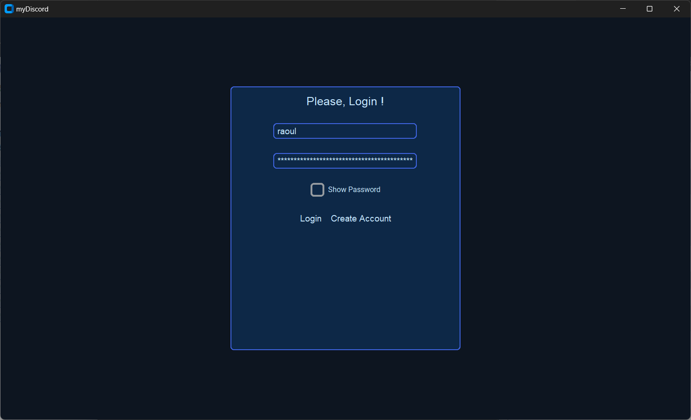
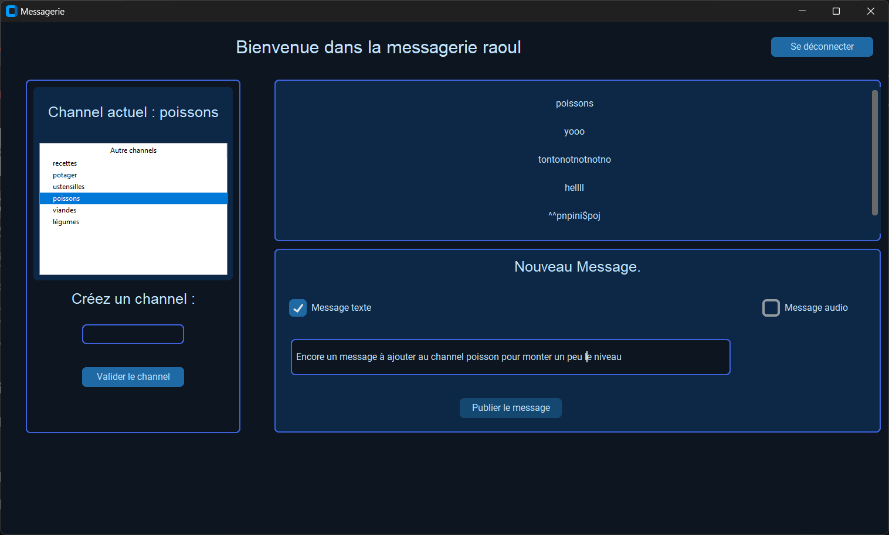

# myDiscord - Février 2024
(Ajout du README fin Juin 2024)

Projet réalisé par 3 étudiants en 1ère année de Bachelor IT spécialité Intelligence Artificielle à La Plateforme_ à Marseille :
- Cyril Genisson
- Bruno Coulet
- Lucas savioz

## Mode d'emploi :

chier contient les identifiant de connexion à la base de donnée.
Il n'est donc pas stocké sur le repo public

Lancer le script login.py pour se connecter à un compte.
L'interface graphique pour la créaction de compte et la connexion à un compte existant s'affiche.

Sélectionner un compte existant, par exemple
- **login :**  
raoul
- **mot de passe :**  
b'$2b$12$c/Nh4OLeJETnPKyW7ubgSOReebGdq7dQernLgqbZIWbm0ZVxDh15u'

L'interface graphique de connexion se ferme, puis l'interface du chat s'affiche à son tour.

L'utilisateur peut  :
- Sélectionner un channel existant, cela affiche les messages du channel sélectionné.
- Créer un channel.
- Ajouter un message.

**Problème :**
Le message est bien ajouter à la base de donnée, mais l'interface graphique ne se reffraichi pas.

<!--  
## Table of content
- [lingua-franca](#lingua-franca)
  - [Table of content](#table-of-content)
  - [Getting started](#getting-started)
 -->
