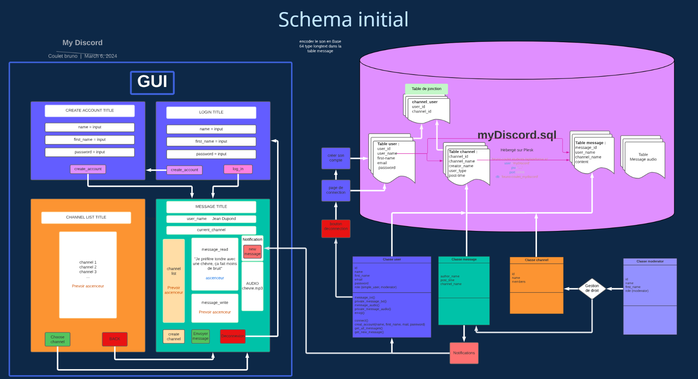

# myDiscord - Février 2024
(Ajout du README fin Juin 2024)

## ATTENTION :  
Le fichier.env est indispensable pour se connecter.  
Ce fichier contient les identifiants de connexion à la base de donnée.  
Il n'est donc pas stocké sur le repo public

## Table des matière

- [Composition de l'équipe](#composition-de-léquipe)
- [répartition des tâches](#répartition-des-tâches)
- [Structure du projet](#structure-du-projet)
- [Diagramme des classes](#diagramme-des-classes)
- [Base de donnée](#base-de-donnée)
- [Mode d'emploi](#mode-demploi)
- [Message audio](#message-audio)
- [Conclusion](#conclusion)

## Composition de l'équipe

Projet réalisé par 3 étudiants en 1ère année de Bachelor IT spécialité Intelligence Artificielle à La Plateforme_ à Marseille :
- Cyril Genisson
- Bruno Coulet
- Lucas savioz

## répartition des tâches

## Structure du projet

## Diagramme des classes

## Base de donnée

## Mode d'emploi:

Lancer le script login.py pour se connecter à un compte.
L'interface graphique pour la créaction de compte et la connexion à un compte existant s'affiche.

Sélectionner un compte existant, par exemple
- **login :**  
raoul
- **mot de passe :**  
b'$2b$12$c/Nh4OLeJETnPKyW7ubgSOReebGdq7dQernLgqbZIWbm0ZVxDh15u'

L'interface graphique de connexion se ferme, puis l'interface du chat s'affiche à son tour.

L'utilisateur peut  :
- Sélectionner un channel existant, cela affiche les messages du channel sélectionné.
- Créer un channel.
- Ajouter un message.

**Problème :**
Le message est bien ajouté à la base de donnée, mais l'interface graphique ne se reffraichi pas.

## Version 2 - Message audio
Une version alternative permet de gérer les message audio encodé en base 64.
Nous n'avons pas eu le temps de fusionner les 2 versions ...

## Versionning - branches

## Conclusion

